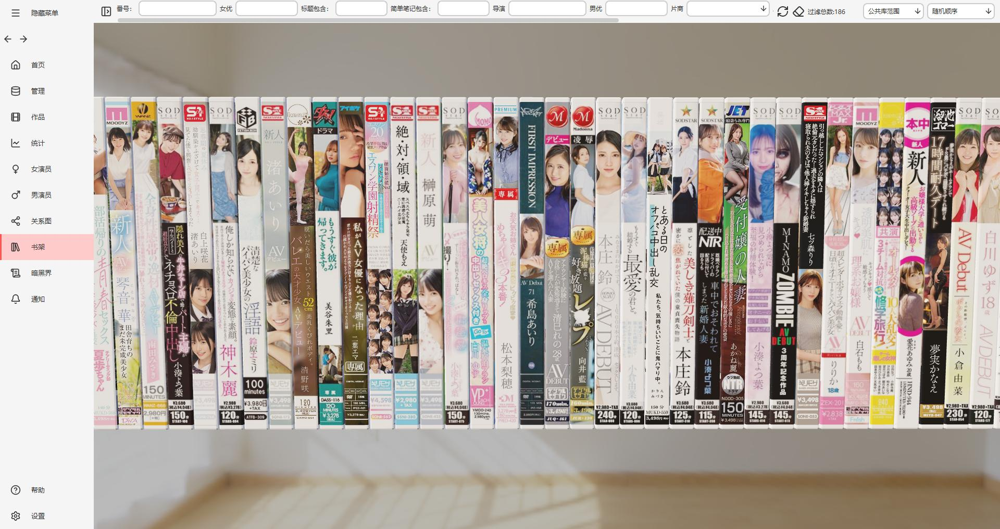
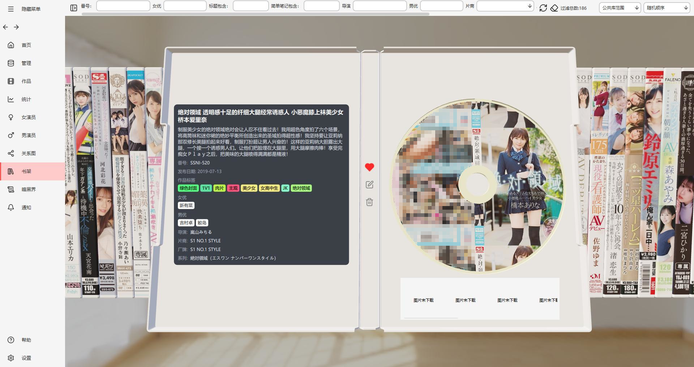
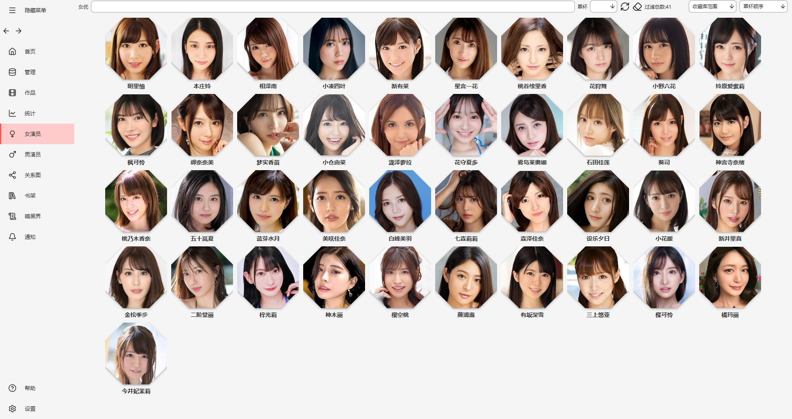
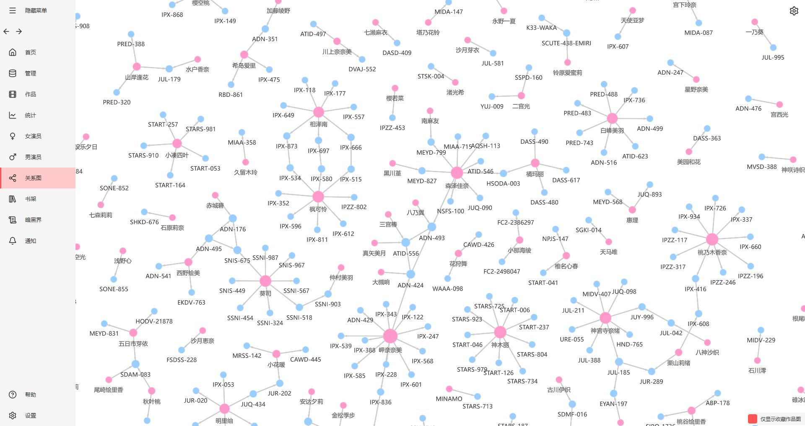
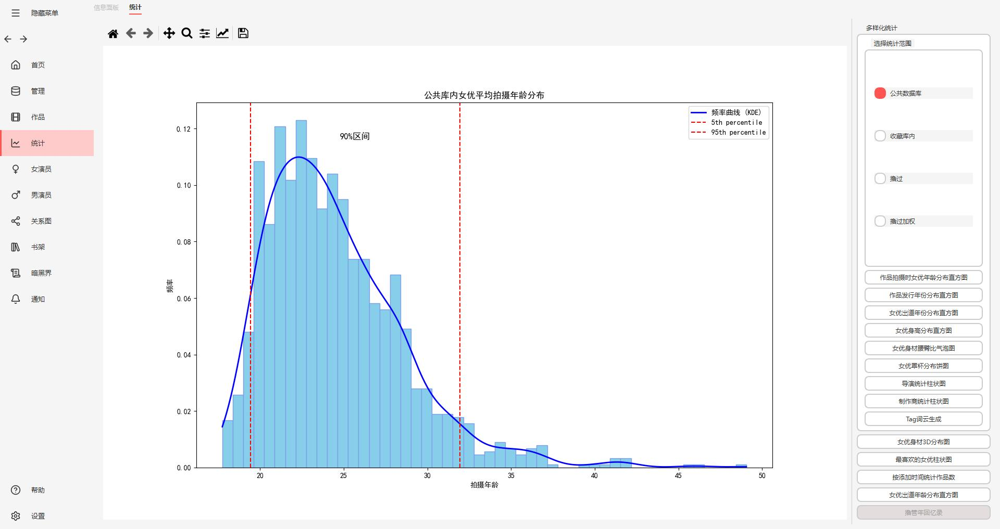
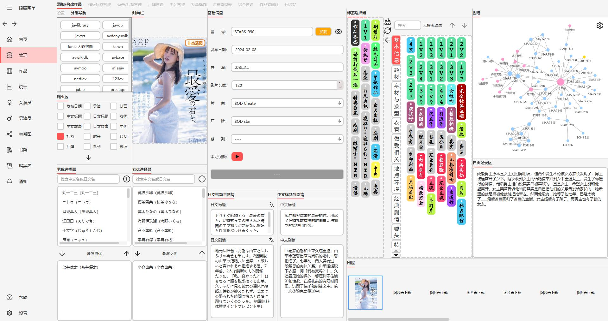
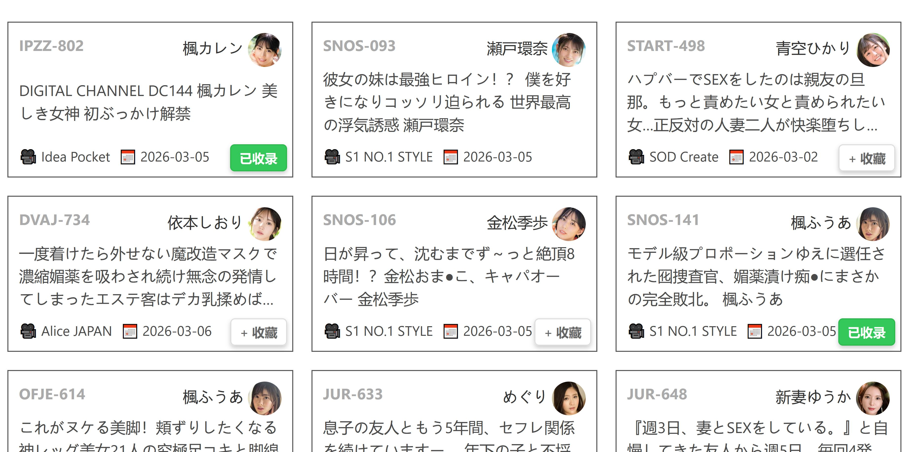

  
  <h1>DarkEye</h1>
  
<strong>洞察與秩序</strong>

  
一個純本機的個人媒體資料庫、中繼資料編輯器、關係分析器與歸檔瀏覽器。

   

[![README · 日本語][badge-readme-ja]](README.md)
[![README · 简体中文][badge-readme-zh-CN]](README.CN.md)
[![README · 繁體中文][badge-readme-zh-TW]](README.zh-TW.md)

![Qt 6.10][badge-qt]
![C++][badge-cpp]
![CMake][badge-cmake]
![MSVC 2022][badge-msvc]
[![SQLite][badge-sqlite]](https://sqlite.org/)
![Platform][badge-platform]
![License][badge-license]
![GitHub last commit][badge-last-commit]
![GitHub release][badge-release]
![GitHub Repo stars][badge-stars]
![GitHub all releases][badge-downloads]

 

[📖 線上文件][link-docs]
[🎥 影片介紹][link-video]
[🌐 官網][link-website]
[💬 Discord][link-discord]

  <a href="#download">下載與使用</a> •
  <a href="#compliance">合法合規使用聲明</a> •
  <a href="#features">特性</a> •
  <a href="#screenshots">介面預覽</a> •
  <a href="#privacy">隱私與資料</a> •
  <a href="#migration">遷移與匯入</a> •
  <a href="#crawler">抓取說明</a> •
  <a href="#development">開發與技術</a> •
  <a href="#community">社群</a> •
  <a href="#references">參考專案</a>

  

## 下載與使用

  

  

下載程式並解壓縮，執行 exe 即可；瀏覽器擴充功能隨軟體附帶在 `extensions` 目錄內。請依下方文件安裝**對應瀏覽器的一種**擴充功能。

### 瀏覽器擴充功能安裝

👉 [線上文件：瀏覽器擴充功能安裝](https://gty5678.github.io/darkeye/usage/#_2)

除非瀏覽器擴充功能單獨更新，一般**不需要**單獨下載瀏覽器擴充功能。

  
  　　
  

### 使用說明

👉 [線上文件：使用](https://gty5678.github.io/darkeye/usage/#_3)

### 版本與更新

👉 [常見問題：更新與遷移](https://gty5678.github.io/darkeye/faq/)

設定中可自動更新**軟體本體**；軟體不會自動更新，但是**外掛**會在軟體 `extensions` 目錄更新，需要**手動到瀏覽器重新載入**。外掛另外可在 [Releases][link-releases] 手動下載。

遷移版本時請**更新瀏覽器擴充功能**。抓取器可能因站點變更而很快失效，並會依據回饋人工維護；代理問題無法由軟體解決。只要目標站點能在瀏覽器中開啟，通常即可抓取。

---

## 合法合規使用聲明

- 本工具僅用於管理使用者依法擁有、已獲授權或可合法處理的資料與中繼資訊。
- 使用本工具時，請遵守各國現行法律法規及相關規定。
- 嚴禁將本工具用於非法抓取、侵權傳播、繞過網站存取控制、未經授權處理他人資料等行為。
- 第三方網站內容、介面與存取規則以其平台條款為準，使用者應自行確認並承擔相應合規責任。

---

## 特性

### 已實現

| **功能** | **說明** | **狀態** |
| -------- | -------- | -------- |
| **資料管理** | 媒體條目、人物與標籤等基礎資料增刪查改 | ✅ |
| **個人記錄** | 自訂記錄條目的手動新增與增刪查改 | ✅ |
| **分析與圖表** | 分析圖表與資料展示（仍有部分未完成功能） | ✅ |
| **擬物化 DVD 盒子陳列** | 擬物化 DVD 陳列與收藏體驗 | ✅ |
| **篩選過濾展示** | 篩選作品頁面 | ✅ |
| **瀏覽器擴充功能** | Chrome / Edge / Firefox 擴充功能，支援沉浸式、互動式的多站點抓取 | ✅ |
| **簡易抓取** | 可用性和品質取決於目標站點的公開政策及存取規則；詳見文件 | ✅ |
| **關聯圖譜** | 檢視關聯；約 1 萬節點下約 60 幀 | ✅ |
| **翻譯** | LLM 翻譯 + 一鍵覆蓋翻譯 | ✅ |
| **本機影片連結** | 若本機已有影片，可將影片連結到資料庫 | ✅ |
| **備份** | 備份系統，用於本機資料歸檔與還原 | ✅ |
| **主題** | 主題切換（3D 場景尚不完全跟隨明／暗） | ✅ |
| **螢幕截圖** | 部分介面支援截圖；女優頁面可按 C 鍵 | ✅ |
| **自動更新** | 自動檢測並下載更新 | ✅ |
| **mdcz NFO 匯入** | [mdcz](https://github.com/ShotHeadman/mdcz) NFO 匯入 | ✅ |
| **Jvedio NFO 匯入** | Jvedio 資料匯出 NFO（測試中） | ✅ |

### 計劃與推進中

| **功能** | **說明** | **狀態** |
| -------- | -------- | -------- |
| **NFO 匯出** | 形成共識後開發；各工具實作不一，目前資料欄位仍不齊 | 🔄 |

長期規劃與更多細項見 [**更新日誌與路線圖**](docs/CHANGELOG.md)（隨開發滾動更新，不代表固定排期）。

- **AI / 工具整合**：探索 CLI 與互動式能力（CHANGELOG 的 `3.x` 路線圖）。
- **同步與共享**：WebDAV、多端備份、UGC 式資訊協作等（`2.x`）。
- **體驗與基礎設施**：持續改進標籤、圖譜、UI、匯出、抓取器與資料庫（`1.x`）。

---

## 遷移與匯入

### mdcz 專案 NFO 匯入

已支援 [mdcz](https://github.com/ShotHeadman/mdcz) 產出的 NFO 匯入。

👉 [線上文件：mdcz NFO](https://gty5678.github.io/darkeye/usage/#mdcz-nfo)

### Jvedio 遷移資料

👉 [線上文件：Jvedio](https://gty5678.github.io/darkeye/usage/#jvedio)

---

## 隱私與資料

- **資料與連線**：預設資料在程式旁的 `data/`（資料庫、設定、封面與頭像等）。不會主動向第三方上傳你的本機資料；連線主要來自刮削與資源拉取，以及選用的更新下載（Cloudflare R2）、翻譯（Google 或你自備的 LLM API）等。第三方服務由使用者自主啟用並自行承擔合規責任。

---

## 介面預覽

### 擬物化 DVD

### 力導向圖

### 分析圖表

### 多作品瀑布流

### 編輯介面

### 瀏覽器擴充功能（站點範例）

開啟擴充功能後，它會與本機應用程式連線；點擊「新增」即可啟動抓取器並匯入本機。頁面上的「收藏／收錄」等功能僅在連接本機軟體時可用。

---

## 抓取說明

目前抓取會嘗試取得作品的發布日期、導演、中日標題與簡介、女優和男優（如適用）、標籤、封面、片長、廠商、廠牌、系列、劇照等資訊。

女優資訊主要會取得頭像、出生日期、出道日期、三圍、身高與罩杯、曾用名等（曾用名的更新路徑尚未實作，因此首次以舊名登記時可能出現不一致）。

首次抓取時，目標站點可能會依其存取政策顯示驗證或限制。是否能繼續取決於站點規則及使用者的存取權限。

目前支援多個公開資料站點。實際可用站點會隨版本和目標站點政策變化，請以最新線上文件為準。

---

## 開發與技術

主要技術以 PySide6 / Qt Quick 3D、SQLite、本機 FastAPI 與瀏覽器擴充功能協同，並含 C++ 力導向圖加速。

若想開發，請先閱讀以下文件，將軟體執行起來。

👉 [開發文件](https://gty5678.github.io/darkeye/development/)

---

## 社群

有問題或想法？歡迎加入 Discord：[加入社群][link-discord]

- **新手支援**：文件閱讀中有疑問歡迎提問；線上文件持續完善中。
- **提前獲知進展**：新功能、開發進展與預釋出版本會先在 Discord 討論。
- **參與方向**：想影響 roadmap，歡迎來討論。

---

## 參考專案

- [mdcz](https://github.com/ShotHeadman/mdcz)（遷移相容參考）
- [Jvedio](https://github.com/hitchao/Jvedio)（遷移相容參考）
- [JavSP](https://github.com/Yuukiy/JavSP)（站點適配思路參考）
- [JAV-JHS](https://sleazyfork.org/zh-CN/scripts/558525-jav-jhs)（資訊整理思路參考）
- [JAV_MovieManager](https://github.com/4evergaeul/JAV_MovieManager)（媒體管理互動參考）
- [stash](https://github.com/stashapp/stash)
- [AMMDS](https://github.com/QYG2297248353/AMMDS-Docker)
- [mdc-ng](https://github.com/mdc-ng/mdc-ng)

---

## 授權

本專案依 [GNU General Public License v3.0](LICENSE) 授權釋出。

---
## 貢獻者

---

DarkEye — 本機資料書架，安全自管。

<!-- Badge images -->

[badge-readme-zh-CN]: https://img.shields.io/badge/README%20%C2%B7%20%E7%AE%80%E4%BD%93%E4%B8%AD%E6%96%87-555555?style=for-the-badge
[badge-readme-zh-TW]: https://img.shields.io/badge/README%20%C2%B7%20%E7%B9%81%E9%AB%94%E4%B8%AD%E6%96%87-2ea44f?style=for-the-badge
[badge-readme-ja]: https://img.shields.io/badge/README%20%C2%B7%20%E6%97%A5%E6%9C%AC%E8%AA%9E-555555?style=for-the-badge
[badge-qt]: https://img.shields.io/badge/Qt-6.10.3-41CD52?logo=qt&logoColor=white
[badge-cpp]: https://img.shields.io/badge/C%2B%2B-20-00599C?logo=cplusplus
[badge-cmake]: https://img.shields.io/badge/CMake-CMake-064F8C?logo=cmake
[badge-msvc]: https://img.shields.io/badge/MSVC-2022-5C2D91?logo=data%3Aimage%2Fsvg%2Bxml%3Bbase64%2CPHN2ZyByb2xlPSJpbWciIHZpZXdCb3g9IjAgMCAyNCAyNCIgeG1sbnM9Imh0dHA6Ly93d3cudzMub3JnLzIwMDAvc3ZnIj48dGl0bGU%2BVmlzdWFsIFN0dWRpbzwvdGl0bGU%2BPHBhdGggZmlsbD0id2hpdGUiIGQ9Ik0xNy41ODMuMDYzYTEuNSAxLjUgMCAwMC0xLjAzMi4zOTIgMS41IDEuNSAwIDAwLS4wMDEgMEEuODguODggMCAwMDE2LjUuNUw4LjUyOCA5LjMxNiAzLjg3NSA1LjVsLS40MDctLjM1YTEgMSAwIDAwLTEuMDI0LS4xNTQgMSAxIDAgMDAtLjAxMi4wMDVsLTEuODE3Ljc1YTEgMSAxIDAgMDAtLjA3Ny4wMzYgMSAxIDAgMDAtLjA0Ny4wMjggMSAxIDAgMDAtLjAzOC4wMjIgMSAxIDAgMDAtLjA0OC4wMzQgMSAxIDAgMDAtLjAzLjAyNCAxIDEgMCAwMC0uMDQ0LjAzNiAxIDEgMCAwMC0uMDM2LjAzMyAxIDEgMCAwMC0uMDMyLjAzNSAxIDEgMCAwMC0uMDMzLjAzOCAxIDEgMCAwMC0uMDM1LjA0NCAxIDEgMCAwMC0uMDI0LjAzNCAxIDEgMCAwMC0uMDMyLjA1IDEgMSAwIDAwLS4wMi4wMzUgMSAxIDAgMDAtLjAyNC4wNSAxIDEgMCAwMC0uMDIuMDQ1IDEgMSAwIDAwLS4wMTYuMDQ0IDEgMSAwIDAwLS4wMTYuMDQ3IDEgMSAwIDAwLS4wMTUuMDU1IDEgMSAwIDAwLS4wMS4wNCAxIDEgMCAwMC0uMDA4LjA1NCAxIDEgMCAwMC0uMDA2LjA1QTEgMSAwIDAwMCA2LjY2OHYxMC42NjZhMSAxIDAgMDAuNjE1LjkxN2wxLjgxNy43NjRhMSAxIDAgMDAxLjAzNS0uMTY0bC40MDgtLjM1IDQuNjUzLTMuODE1IDcuOTczIDguODE1YTEuNSAxLjUgMCAwMC4wNzIuMDY1IDEuNSAxLjUgMCAwMC4wNTcuMDUgMS41IDEuNSAwIDAwLjA1OC4wNDIgMS41IDEuNSAwIDAwLjA2My4wNDQgMS41IDEuNSAwIDAwLjA2NS4wMzggMS41IDEuNSAwIDAwLjA2NS4wMzYgMS41IDEuNSAwIDAwLjA2OC4wMzEgMS41IDEuNSAwIDAwLjA3LjAzIDEuNSAxLjUgMCAwMC4wNzMuMDI1IDEuNSAxLjUgMCAwMC4wNjYuMDIgMS41IDEuNSAwIDAwLjA4LjAyIDEuNSAxLjUgMCAwMC4wNjguMDE0IDEuNSAxLjUgMCAwMC4wNzUuMDEgMS41IDEuNSAwIDAwLjA3NS4wMDggMS41IDEuNSAwIDAwLjA3My4wMDMgMS41IDEuNSAwIDAwLjA3NyAwIDEuNSAxLjUgMCAwMC4wNzgtLjAwNSAxLjUgMS41IDAgMDAuMDY3LS4wMDcgMS41IDEuNSAwIDAwLjA4Ny0uMDE1IDEuNSAxLjUgMCAwMC4wNi0uMDEyIDEuNSAxLjUgMCAwMC4wOC0uMDIyIDEuNSAxLjUgMCAwMC4wNjgtLjAyIDEuNSAxLjUgMCAwMC4wNy0uMDI4IDEuNSAxLjUgMCAwMC4wOS0uMDM3bDQuOTQ0LTIuMzc3YTEuNSAxLjUgMCAwMC40NzYtLjM2MiAxLjUgMS41IDAgMDAuMDktLjExMiAxLjUgMS41IDAgMDAuMDA0LS4wMDcgMS41IDEuNSAwIDAwLjA4LS4xMjUgMS41IDEuNSAwIDAwLjA2Mi0uMTIgMS41IDEuNSAwIDAwLjAwOS0uMDE3IDEuNSAxLjUgMCAwMC4wNC0uMTA4IDEuNSAxLjUgMCAwMC4wMTUtLjAzNyAxLjUgMS41IDAgMDAuMDMtLjEwNyAxLjUgMS41IDAgMDAuMDA5LS4wMzcgMS41IDEuNSAwIDAwLjAxNy0uMSAxLjUgMS41IDAgMDAuMDA4LS4wNSAxLjUgMS41IDAgMDAuMDA2LS4wOSAxLjUgMS41IDAgMDAuMDA0LS4wOFYzLjk0MmExLjUgMS41IDAgMDAwLS4wMDMgMS41IDEuNSAwIDAwMC0uMDMyIDEuNSAxLjUgMCAwMC0uMDEtLjE1IDEuNSAxLjUgMCAwMC0uODQtMS4xN0wxOC4yMDYuMjFhMS41IDEuNSAwIDAwLS42MjItLjE0NnpNMTggNi45MnYxMC4xNjNsLTYuMTk4LTUuMDh6TTMgOC41NzRsMy4wOTkgMy40MjctMy4xIDMuNDI2eiIvPjwvc3ZnPg%3D%3D
[badge-sqlite]: https://img.shields.io/badge/SQLite-local%20storage-003B57?logo=sqlite&logoColor=white
[badge-platform]: https://img.shields.io/badge/Platform-Windows-0078D4?logo=data%3Aimage%2Fsvg%2Bxml%3Bbase64%2CPHN2ZyByb2xlPSJpbWciIHZpZXdCb3g9IjAgMCAyNCAyNCIgeG1sbnM9Imh0dHA6Ly93d3cudzMub3JnLzIwMDAvc3ZnIj48dGl0bGU%2BV2luZG93czwvdGl0bGU%2BPHBhdGggZmlsbD0id2hpdGUiIGQ9Ik0wIDMuNDQ5TDkuNzUgMi4xdjkuNDUxSDBtMTAuOTQ5LTkuNjAyTDI0IDB2MTEuNEgxMC45NDlNMCAxMi42aDkuNzV2OS40NTFMMCAyMC42OTlNMTAuOTQ5IDEyLjZIMjRWMjRsLTEyLjktMS44MDEiLz48L3N2Zz4%3D
[badge-license]: https://img.shields.io/github/license/gty5678/darkeye-cpp
[badge-last-commit]: https://img.shields.io/github/last-commit/gty5678/darkeye-cpp
[badge-release]: https://img.shields.io/github/v/release/gty5678/darkeye-cpp
[badge-stars]: https://img.shields.io/github/stars/gty5678/darkeye-cpp?style=social
[badge-downloads]: https://img.shields.io/github/downloads/gty5678/darkeye-cpp/total

<!-- Links -->

[link-docs]: https://gty5678.github.io/darkeye-cpp/
[link-video]: https://youtu.be/VCsw1D0ccgY?si=e9typx4kPnzaVFZq
[link-website]: https://gty5678.github.io/darkeye-webpage/
[link-discord]: https://discord.gg/3thnEguWUk
[link-releases]: https://github.com/gty5678/darkeye-cpp/releases
